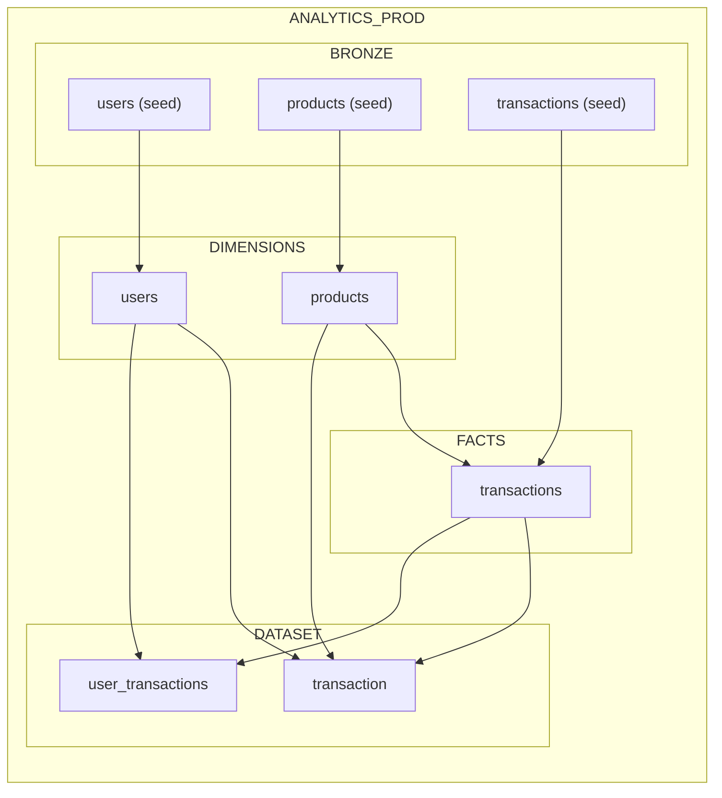
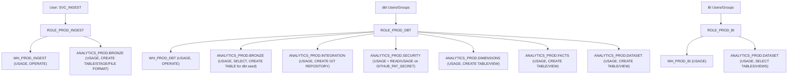

# snowflake-dbt

Production-first Snowflake + dbt template using a medallion architecture in one database:
- Bronze: raw ingestion from dbt seeds
- Silver: dimensions and facts
- Gold: analytics marts

## Target Model Layout

Database: `ANALYTICS_PROD`
Schemas:
- `BRONZE`: `users`, `products`, `transactions` (from CSV seeds)
- `DIMENSIONS`: `users`, `products`
- `FACTS`: `transactions`
- `DATASET`: `transaction`, `user_transactions`

## Database Diagram

## RBAC Diagram (Bootstrap)

### RBAC Permission Matrix

| Role | Warehouse Permissions | Database/Schema Permissions | Data/Object Permissions |
|---|---|---|---|
| `ROLE_PROD_INGEST` | `WH_PROD_INGEST`: `USAGE`, `OPERATE` | `ANALYTICS_PROD`: `USAGE`; `BRONZE`: `USAGE` | `BRONZE`: `CREATE TABLE`, `CREATE STAGE`, `CREATE FILE FORMAT` |
| `ROLE_PROD_DBT` | `WH_PROD_DBT`: `USAGE`, `OPERATE` | `ANALYTICS_PROD`: `USAGE`; `BRONZE`, `DIMENSIONS`, `FACTS`, `DATASET`, `SECURITY`, `INTEGRATION`: `USAGE` | `BRONZE`: `SELECT` on all/future tables, `CREATE TABLE` (for `dbt seed`); `INTEGRATION`: `CREATE GIT REPOSITORY`; `DIMENSIONS`/`FACTS`/`DATASET`: `CREATE TABLE`, `CREATE VIEW`; `SECURITY`: `READ`/`USAGE` on `GITHUB_PAT_SECRET` |
| `ROLE_PROD_BI` | `WH_PROD_BI`: `USAGE` | `ANALYTICS_PROD`: `USAGE`; `DATASET`: `USAGE` | `DATASET`: `SELECT` on all/future tables and views |

## Prerequisites

- Snowflake account with admin roles for bootstrap (`ACCOUNTADMIN`, `SECURITYADMIN`)
- dbt Core with Snowflake adapter installed (`dbt-snowflake`)
- Access to this repository locally

## Python Setup

Use the bootstrap script to create a `pyenv` virtualenv named `snowflake-dbt` and install dependencies from `requirements.txt`.

- Default Python version:
  - `./scripts/setup_python.sh`
- Pin Python version explicitly:
  - `./scripts/setup_python.sh 3.12.5`
- Activate environment:
  - `pyenv activate snowflake-dbt`

## Git Integration Setup (Snowflake)

To connect Snowflake to GitHub for this project (`github.com/mareksyldatk/snowflake-dbt`), run:

- `sql/bootstrap_git_integration.sql`

This script is order-independent and can be run before or after `sql/bootstrap_prod.sql`.

What this script does:
- creates API integration `GITHUB_INT`
- creates secret `ANALYTICS_PROD.SECURITY.GITHUB_PAT_SECRET` (GitHub username + PAT)
- grants access to `ROLE_PROD_DBT`
- creates Git repository object `ANALYTICS_PROD.INTEGRATION.DBT_REPO`
- fetches and validates branches/tags

Before execution, replace:
- `'<YOUR_GITHUB_CLASSIC_PAT>'` in `sql/bootstrap_git_integration.sql`

## Deploy dbt Project in Snowsight (`SNOWFLAKE_DBT`)

After your workspace is connected to this repo and `DBT_REPO` exists, deploy a Snowflake dbt project object:
Reference flow: [Snowflake dbt Projects getting started tutorial](https://docs.snowflake.com/en/user-guide/tutorials/dbt-projects-on-snowflake-getting-started-tutorial#run-the-sql-commands-in-tasty-bytes-setup-sql-to-set-up-source-data).

1. Open `Projects` -> `Workspaces`, then open your dbt workspace.
2. Run `dbt deps` in the workspace command bar.
3. Run `dbt build` once to validate project parsing and permissions.
4. In the top-right menu, select `Connect` -> `Deploy dbt project`.
5. In deploy dialog:
   - Location: `ANALYTICS_PROD` / `INTEGRATION`
   - Select or create object: `Create dbt project`
   - Name: `SNOWFLAKE_DBT`
   - Default target: `prod`
6. Select `Deploy`.

Notes:
- This creates (or replaces) a Snowflake dbt project object, separate from the Git repository object.
- Later updates from workspace use `Connect` -> `Redeploy dbt project` (adds a new project version).
- If the UI cannot find the repo/object, run `sql/bootstrap_dbt_repo.sql` and refresh Snowsight.

## Setup Instructions

0. (Optional) Create local `pyenv` virtualenv for dbt:
   - `./scripts/setup_python.sh`
   - Or pin a version: `./scripts/setup_python.sh 3.12.5`

1. Run core Snowflake bootstrap SQL:
   - Open and execute `sql/bootstrap_prod.sql`.
   - This creates warehouses, database/schemas, roles, and the optional ingest service user.

2. Run Git integration bootstrap SQL (can be before or after step 1):
   - Open and execute `sql/bootstrap_git_integration.sql`.
   - Replace `'<YOUR_GITHUB_CLASSIC_PAT>'` first.
   - If `DBT_REPO` is missing in Snowsight, run `sql/bootstrap_dbt_repo.sql` to (re)create `ANALYTICS_PROD.INTEGRATION.DBT_REPO`.

3. Configure dbt profile:
   - Copy `profiles.yml.example` to your dbt profiles location as `profiles.yml`.
   - Typical location: `~/.dbt/profiles.yml`.
   - For Snowflake managed dbt projects in UI, `account`/`user` are not needed in the example profile.

4. Install dbt package dependencies:
   - `dbt deps`

5. Load Bronze data from seeds:
   - `dbt seed --target prod`
   - This project includes `macros/generate_schema_name.sql` so layer schemas are used as-is (`BRONZE`, `DIMENSIONS`, `FACTS`, `DATASET`) without dbt prefixing.

6. Build Silver + Gold models and run tests:
   - `dbt build --target prod`

## Expected Outputs

After successful run:
- Bronze tables from CSV: `ANALYTICS_PROD.BRONZE.users/products/transactions`
- Silver tables: `ANALYTICS_PROD.DIMENSIONS.users`, `ANALYTICS_PROD.DIMENSIONS.products`, `ANALYTICS_PROD.FACTS.transactions`
- Gold marts: `ANALYTICS_PROD.DATASET.transaction`, `ANALYTICS_PROD.DATASET.user_transactions`

## Notes

- Replace placeholder service-user passwords in `sql/bootstrap_prod.sql` before use.
