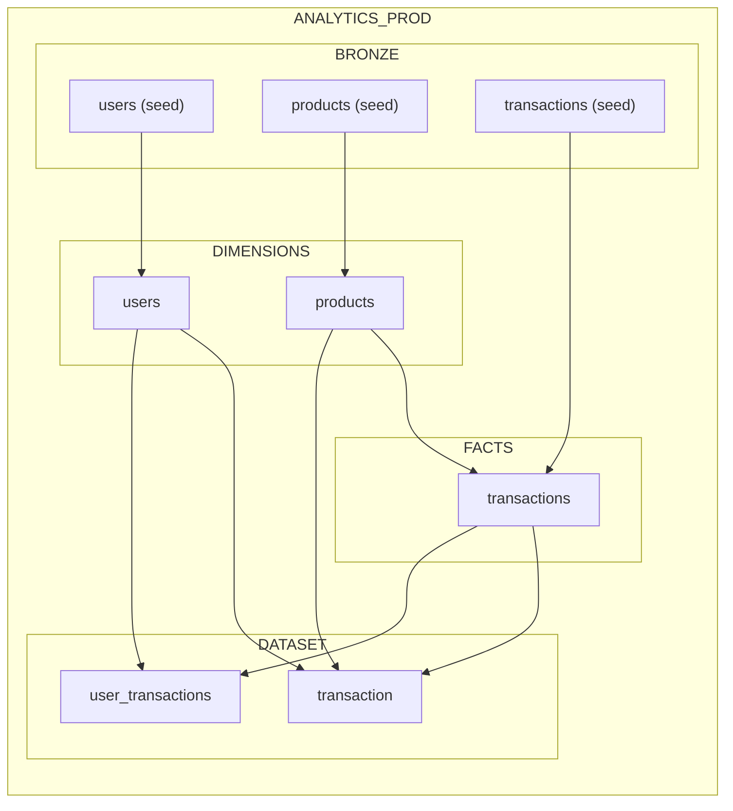
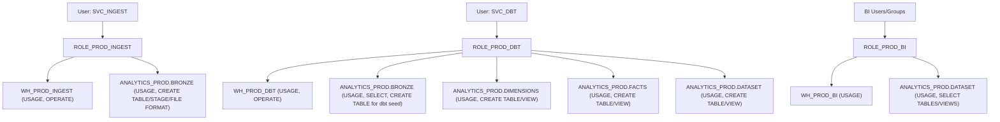

# snowflake-dbt

Production-first Snowflake + dbt template using a medallion architecture in one database:
- Bronze: raw ingestion from dbt seeds
- Silver: dimensions and facts
- Gold: analytics marts

## Target Model Layout

Database: `ANALYTICS_PROD`
Schemas:
- `BRONZE`: `users`, `products`, `transactions` (from CSV seeds)
- `DIMENSIONS`: `users`, `products`
- `FACTS`: `transactions`
- `DATASET`: `transaction`, `user_transactions`

## Database Diagram

## RBAC Diagram (Bootstrap)

### RBAC Permission Matrix

| Role | Warehouse Permissions | Database/Schema Permissions | Data/Object Permissions |
|---|---|---|---|
| `ROLE_PROD_INGEST` | `WH_PROD_INGEST`: `USAGE`, `OPERATE` | `ANALYTICS_PROD`: `USAGE`; `BRONZE`: `USAGE` | `BRONZE`: `CREATE TABLE`, `CREATE STAGE`, `CREATE FILE FORMAT` |
| `ROLE_PROD_DBT` | `WH_PROD_DBT`: `USAGE`, `OPERATE` | `ANALYTICS_PROD`: `USAGE`; `BRONZE`, `DIMENSIONS`, `FACTS`, `DATASET`: `USAGE` | `BRONZE`: `SELECT` on all/future tables, `CREATE TABLE` (for `dbt seed`); `DIMENSIONS`/`FACTS`/`DATASET`: `CREATE TABLE`, `CREATE VIEW` |
| `ROLE_PROD_BI` | `WH_PROD_BI`: `USAGE` | `ANALYTICS_PROD`: `USAGE`; `DATASET`: `USAGE` | `DATASET`: `SELECT` on all/future tables and views |

## Prerequisites

- Snowflake account with admin roles for bootstrap (`ACCOUNTADMIN`, `SECURITYADMIN`)
- dbt Core with Snowflake adapter installed (`dbt-snowflake`)
- Access to this repository locally

## Setup Instructions

0. (Optional) Create local `pyenv` virtualenv for dbt:
   - `./scripts/setup_pyenv_virtualenv.sh`
   - Or pin a version: `./scripts/setup_pyenv_virtualenv.sh 3.12.5`

1. Run Snowflake bootstrap SQL:
   - Open and execute `sql/bootstrap_prod.sql`.
   - This creates warehouses, database/schemas, roles, and service users.

2. Configure dbt profile:
   - Copy `profiles.yml.example` to your dbt profiles location as `profiles.yml`.
   - Typical location: `~/.dbt/profiles.yml`.
   - Fill in your Snowflake `account`, `user`, and auth method.

3. Install dependencies (template currently has none):
   - `dbt deps`

4. Load Bronze data from seeds:
   - `dbt seed --target prod`

5. Build Silver + Gold models and run tests:
   - `dbt build --target prod`

## Expected Outputs

After successful run:
- Bronze tables from CSV: `ANALYTICS_PROD.BRONZE.users/products/transactions`
- Silver tables: `ANALYTICS_PROD.DIMENSIONS.users`, `ANALYTICS_PROD.DIMENSIONS.products`, `ANALYTICS_PROD.FACTS.transactions`
- Gold marts: `ANALYTICS_PROD.DATASET.transaction`, `ANALYTICS_PROD.DATASET.user_transactions`

## Notes

- Replace placeholder service-user passwords in `sql/bootstrap_prod.sql` before use.
- Prefer key-pair auth for `SVC_DBT` in production.
